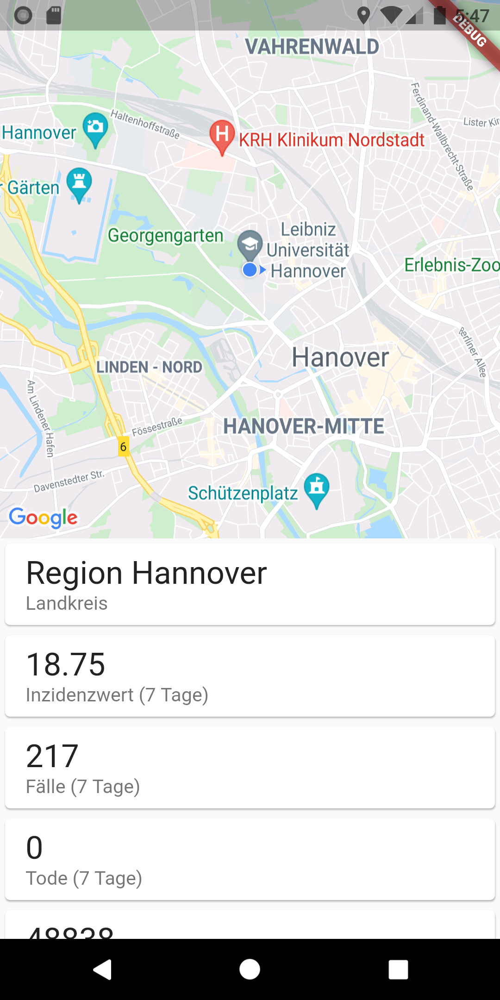
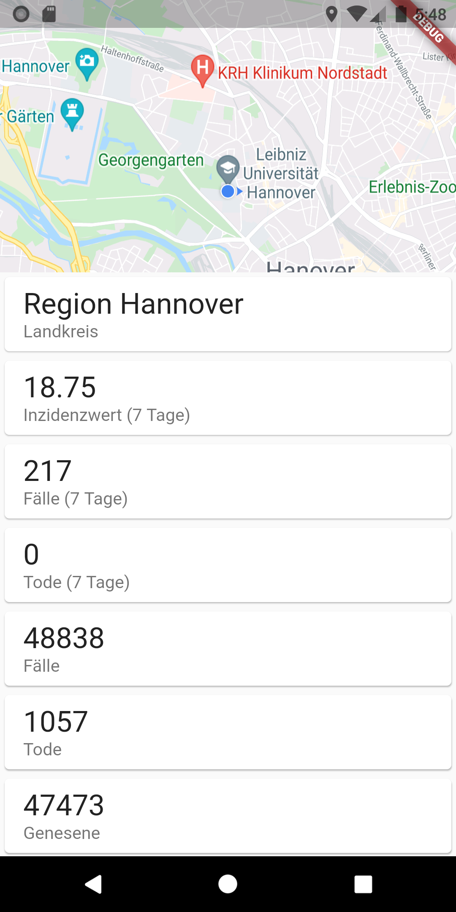

#  Corona Info App


## Demo
  

## Installation
**Die App nutzt die Google Cloud API und muss deshalb vor dem Ausführen über gültige API Keys verfügen. Aus diesem Grund kann keine fertige APK oder ähnliches zur Verfügung gestellt werden. Die folgende Anleitung beschreibt, wie das Projekt gestartet werden kann.**

### Voraussetzungen
- [git](https://git-scm.com/downloads)
- [Flutter](https://flutter.dev/docs/get-started/install)
- [Android Studio](https://developer.android.com/studio/install) mit Android Emulator (Android API Version >= 20; getestet mit Android 9 und 10)
- [VS Code](https://code.visualstudio.com/download) und [Flutter Plugin](https://flutter.dev/docs/get-started/editor?tab=vscode)
- [Google Cloud Account](https://console.cloud.google.com) und unter APIs und Dienste folgendes aktivieren:
  - MAPS SDK for Android aktivieren
  - Geocoding API aktivieren
  - API Key erstellen

### Starten
Projekt clonen und öffnen:
```
git clone https://github.com/CedricFauth/Corona-Info-App.git
code Corona-Info-App
```

Google Cloud API Key in folgenden Files einfügen:
lib/main.dart:12:
```dart
const APIKEY = "abc...";
```

android/app/src/main/AndroidManifest.xml:15
```xml
<!--maps-->
<meta-data android:name="com.google.android.geo.API_KEY"
  android:value="abc..."/>
```

In VS Code den richtigen Emulator auswählen und die App starten: 
```
flutter run
```

APKs können ebenfalls erstellt werden:
https://flutter.dev/docs/deployment/android
